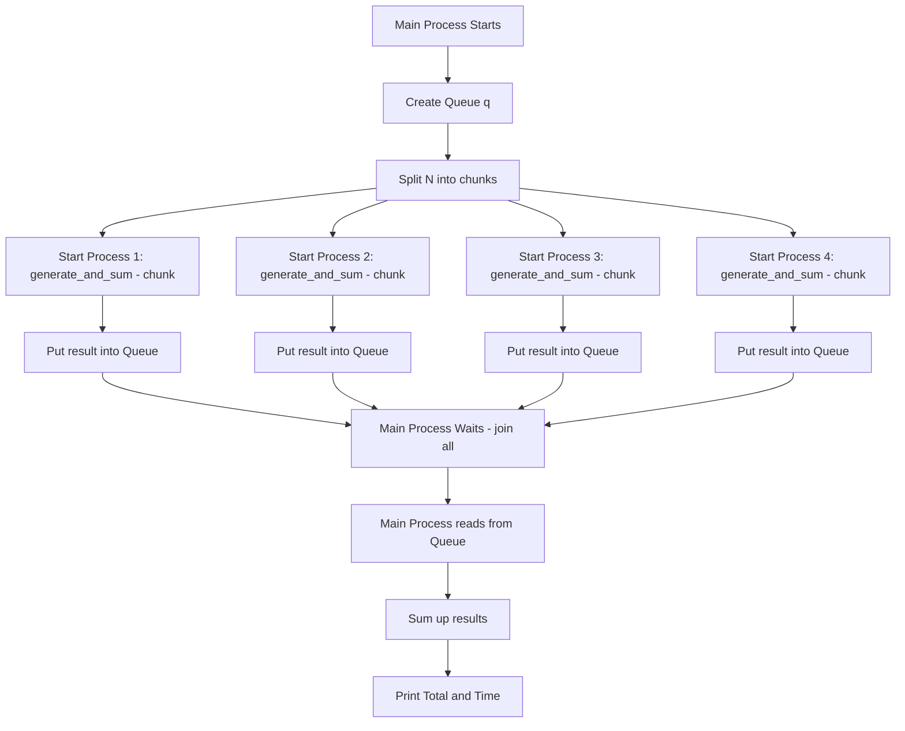
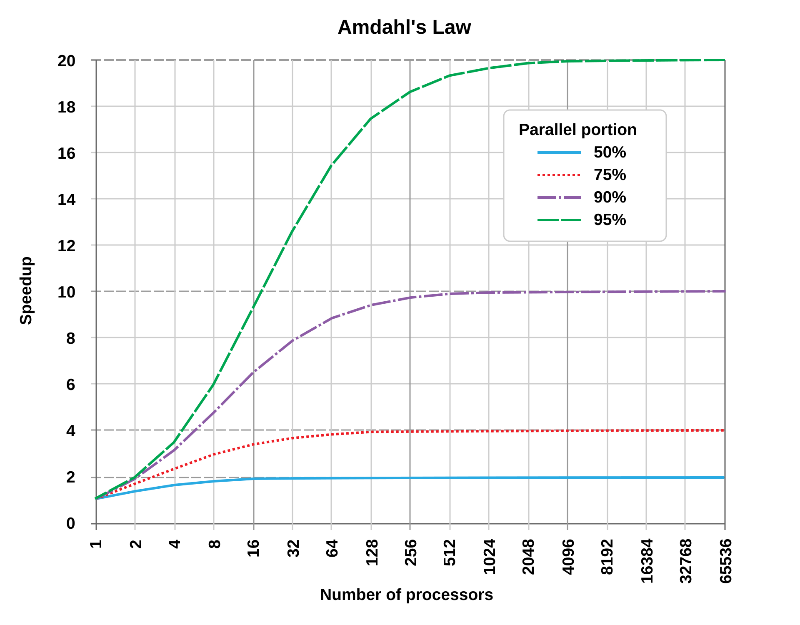

# Introduction to Optimization
If you have any questions: rblc@staff.elte.hu
Also, after class I recommended [this introductory computer science course](https://pll.harvard.edu/course/cs50-introduction-computer-science) from Harvard. It is completely free and gives you a solid conceptual understanding of programming. 

## Optimization Tradeoffs: Speed vs Memory vs Readability

In data-heavy computing (hello bioinformatics) you often face tradeoffs between: speed, memory usage and code readibility. 

Pick one… or maybe two… 

### Python list vs NumPy array

```python
from sys import getsizeof
import numpy as np

py_list = list(range(100000))
np_array = np.array(range(100000))

list_total = getsizeof(py_list) + sum(getsizeof(x) for x in py_list)
np_total = getsizeof(np_array) + np_array.nbytes

print(f"Python list total size: {list_total / 1024:.2f} KB")
print(f"NumPy array total size: {np_total / 1024:.2f} KB")
```

When you create the list above, you also create a container (the list object itself) and a bunch of Python integer objects in memory along with pointers (references) to those objects. 

Also, each number takes up 28 bytes in the memory (even single digit integers) which is a waste of memory space. 

On the other hand, when you create the numpy array, you just create one chunk of memory where you store all the values as simple fixed-size types. An int32 value takes up 4 bytes only. 

You can specifially choose the NumPy type to further optimize. 

| NumPy Type   | Bytes per item | Dtype Code | Python Equivalent | Notes                              |
|--------------|----------------|------------|--------------------|------------------------------------|
| `int8`       | 1              | `i1`       | small integers     | Range: -128 to 127                 |
| `int16`      | 2              | `i2`       | medium integers    | Rarely used                       |
| `int32`      | 4              | `i4`       | `int`              | Standard for large datasets       |
| `int64`      | 8              | `i8`       | big integers       | May be overkill for most          |
| `float32`    | 4              | `f4`       | `float`            | Less precise, more compact        |
| `float64`    | 8              | `f8`       | `float` (default)  | High precision, default           |
| `bool`       | 1              | `?`        | `bool`             | True/False                        |
| `str` / `U10`| Varies         | `U10`      | `str`              | Fixed-length Unicode strings (10 chars × 4 bytes) |

### Memory Tracking (optional)

Be very careful with the script below. It might crash your system by allocating a huge list in the memory.

```python
import tracemalloc

tracemalloc.start()

# Allocate something biiiiiiiig
huge_list = [0] * 10_000_000

current, peak = tracemalloc.get_traced_memory()
print(f"Current memory usage: {current / 10**6:.2f} MB")
print(f"Peak memory usage: {peak / 10**6:.2f} MB")
tracemalloc.stop()
```

What happens when memory runs out? The program crashes with `MemoryError` or your OS uses **swap** (slower virtual memory on disk). The same thing happens when you try to load a huge excel file and your computer goes brrr.

### Self Check

Why can’t we always write the fastest, cleanest, and most memory-efficient code?
What makes NumPy more memory-efficient than a Python list?
What happens when your program exceeds RAM?

## Data Structures

Let’s say we have genomic data like this:

```python
example = [
    {"chrom": "chr1", "start": 100, "end": 200},
    {"chrom": "chr2", "start": 300, "end": 400},
]
```
We can store this in various ways.

```python
# Compare data structures

# Python list of dictionaries
py_dicts = [
    {"chrom": "chr1", "start": 100, "end": 200},
    {"chrom": "chr2", "start": 300, "end": 400},
]
# List of tuples
py_tuples = [
    ("chr1", 100, 200),
    ("chr2", 300, 400),
]
# NumPy array
import numpy as np
np_array = np.array([
    ["chr1", 100, 200],
    ["chr2", 300, 400],
])
# Pandas DataFrame
import pandas as pd

df = pd.DataFrame({
    "chrom": ["chr1", "chr2"],
    "start": [100, 300],
    "end": [200, 400],
})
```

But if we check the sizes, something weird happens:

Python list of dicts: 978 bytes
Python list of tuples: 418 bytes
NumPy array (object dtype): 1136 bytes
Pandas DataFrame: 286 bytes

If the numpy array is mixed, it stores everything in unicode. We need to explicitly define what data should be stored in what type.

```python
dtype = [("chrom", "U4"), ("start", "i4"), ("end", "i4")]
np_array_optimized = np.array([
    ("chr1", 100, 200),
    ("chr2", 300, 400),
], dtype=dtype)
```
Now this is only 208 bytes. 

### Self Check
Which structure is usually the most memory-efficient?
Which structure is easiest to read and write in Python?
Why does structure matter when working with large data?

## Picking the right language

Let's see a problem that takes time, adding up the first billion numbers. 

In Python you can do it by using a loop. 

```python
import time
N = 1_000_000_000

start = time.time()
total_loop = 0

for i in range(N):
    total_loop += i

print(f"Loop total: {total_loop}")
print(f"Loop time: {time.time() - start} s")
```

Note that it took some time even on a strong machine. Let's try the same with Python's native `sum()` function.

```python
start = time.time()
total_sum = sum(range(N))
print(f"Sum total: {total_sum}")
print(f"Sum time: {time.time() - start} s")
```
This was much faster. When python runs this function, there is a low level language running in the background, similar to this `C++` script:

```cpp
#include <iostream>
#include <chrono>

int main() {
auto start = std::chrono::high_resolution_clock::now();
long long total = 0;
for (int i = 0; i < 1000000000; ++i) total += i;
std::cout << total << std::endl;
auto end = std::chrono::high_resolution_clock::now();
std::chrono::duration<double> diff = end - start;
std::cout << "Time: " << diff.count() << " s\n";
return 0;
}
```

### Interpreted vs Compiled languages

A **compiled language** (like C++) translates the entire code into machine instructions **before** it runs. So when you execute it, it's already in the fastest form your computer understands.

An **interpreted language** (like Python) reads and executes code **line by line**, while the program is running. This makes it more flexible and easy to write, but slower because it's doing more work at runtime.

That’s why Python is often used for prototyping. It may be too slow for really big tasks, but it's easy to write and debug. Once the code is running as intended, you can "translate" it to a low level language. 

### JIT - Just In Time Compilation
There are languages that were developed specifically for scientific computing, such as Matlab or Julia. The latter is especially known for being "easy as Python, fast as C". 

Julia looks like an interpreted language (just like Python), but in reality it uses **just in time compliation (JIT)**. It doesn't compile the entire code before it runs (like C), but compiles parts of it as needed, on the go. 

While Juila or Matlab were designed to be able to do this there are also Python packages (such as numba) that enable JIT.

Let's see what Julia can do:

```julia
@time total = sum(0:999_999_999)
println(total)
```
(Note that Julia uses 1-indexing instead of 0-indexing, similar to R.)

You may notice that the runtime was extremely low. But how can it be even faster than a language close to machine code?

In scientific computing languages like Julia, many mathematical patterns are recognized and mapped to hardcoded optimizations. In this case, Julia detects that ranges like `(n:m)` are a special case for `sum()` and uses a fast, pre-optimized formula instead of looping (here a `UnitRange` method).

Conceptually, this is similar to the trick the little Gauss allegedly used to sum numbers quickly:

$\sum_{i=1}^{n} i = \frac{n(n+1)}{2}$

Take home message: using your brain can speed up your code. 🙃

```python
start = time.time()
n = 999_999_999
total_sum = n * (1 + n) // 2
print(f"Sum total: {total_sum}")
print(f"Sum time: {time.time() - start} s")
```

See?

### Self Check
When is it worth to use a compiled languge?
Why is Python widely used in scientific tasks despite its slow performance?
What makes Julia "as easy as Python and as fast as C"?
What happens when you sum random numbers instead of a range?

## Introduction to parallel computing
Let's add up 100 thousand random numbers.

```python
from time import time
from random import random, seed
random.seed(42)

start = time()
print(sum([random.random() for _ in range(100_000_000)]))
print(time() - start)
```

It's trivial that if you do only a fraction of the task, it takes less time. If you split the work into multiple chunks and send out the tasks to each thread of your `CPU`, they can process them simultaneously. 

> **SIDE NOTE**
> The terms `core` and `thread` are often used interchangeably. A `core` is a physical processing unit,
> transistors on the chip itself. While a `thread` is a virtual processing unit. The calculation that runs on the transistors.
> Like body and soul.
> Traditionally, one `core` runs one `thread`.
> However, some CPUs are capable of running multiple threads simultaneously on each core.
> (Intel calls it hyperthreading, AMD calls it SMT - Simultaneous Multihreading… Macs use a very different
> approach that is beyond the scope of this class.)

 The following code can show both physical (core) and logical (thread) CPU counts:

 ```python
import psutil
print("Logical CPUs (threads):", psutil.cpu_count(logical=True))
print("Physical cores:", psutil.cpu_count(logical=False))
```
However, it's more practical to just call

```python
os.cpu_count()
```
If you want to optimize your runs, it is important that your task is not divided into more chunks than the number of your logical CPU units. 

During parallel computing, the processing of one "chunk" is called a **worker**. A group of workers is a **pool**. It acts like a manager that distributes the work among them. In Python you can use the `multiprocessing` module to create a pool of workers. 



You can find this code in the `sum_random_mulitprocessing.py` script.

```python
from multiprocessing import Process, Queue
import random
from time import time

# Worker function: does the job and puts the result into a queue

def generate_and_sum(n, output_queue):
    total = sum(random.random() for _ in range(n))
    output_queue.put(total)

if __name__ == "__main__":
    N = 100_000_000
    num_workers = 4 # Or set it based on your CPU count
    chunk_size = N // num_workers
    # Queue to collect results
	q = Queue()
	processes = []

	start = time()
	# Launch processes manually
    for _ in range(num_workers):
		p = Process(target=generate_and_sum, args=(chunk_size, q))
		p.start()
		processes.append(p)

	# Wait for all processes to finish
		for p in processes:
            p.join()
	
    # Collect results from the queue
    total = 0
    while not q.empty():
        total += q.get()

    print(f"Total: {total}")
    print(f"Time: {time() - start:.2f} s")

```

You can also find a much neater code using the `ProcessPoolExecutor` method of the `concurrent.futures` package. The two codes are very similar under the hood.

```python
from concurrent.futures import ProcessPoolExecutor
import random
from time import time
import os

# Function that each worker runs
def generate_and_sum(n):
    return sum(random.random() for _ in range(n))

if __name__ == "__main__":
    N = 100_000_000
    num_workers = 4
    chunk_size = N // num_workers

    start = time()

    # Start parallel execution
    with ProcessPoolExecutor(max_workers=num_workers) as executor:
        results = executor.map(generate_and_sum, [chunk_size] * num_workers)

    total = sum(results)
    print(f"Total: {total}")
    print(f"Time: {time() - start:.2f} s")

```

### Amdahl's Law
It might be tempting to check whether you get faster results if you go beyond the CPU count. To some degree this might even be true due to factors beyond the scope of this class. Eg. you have 8 CPU threads and you set the number of workers to 10. However, if you increase the number of workers even further (eg. 100), you'll notice no difference in performance.

If only part of your code can run in parallel, then no matter how many workers you add, the rest still runs in order — so your speedup hits a wall.



$S(N) = \frac{1}{(1 - P) + \frac{P}{N}}$  
where:  
- $S(N)$ = theoretical speedup with $N$ processors  
- $N$ = number of processors (or cores)  
- $P$ = proportion of the task that can be parallelized (between 0 and 1)

If **P = 0**, then no part can be parallelized, and ( S = 1 ) (no speedup).
If **P = 1**, the entire task is parallelizable, and ( S = N ) (ideal linear speedup).
For most real-world tasks, **0 < P < 1**, so speedup is limited even with many processors.

In simpler terms, splitting a job across 100 workers means each one does less, but managing those workers takes time too. This lies in the concept of the **overhead**.

### Overhead
When we split up a task and run it in parallel, the computer has to do more than just "run stuff faster."\
There’s **extra work** involved — and that extra work is what we call **overhead**. So basically all the additional costs of the work, such as:
- creating processes (also known as "spawning")
- transferring data from one process to the other
- merging results
- context switching (when there are more tasks than cores, CPU keeps jumping between tasks)
- etc.

Overhead can get disproportionately huge. It's especially noticeable when you do small tasks, the workload is heavily unbalanced or there is a lot of communication going on between workers. 

### Task Parallelism vs Data Parallelism
So far we've seen how a work can be split into chunks for parallel computing. However, there is a difference between doing the same work on different chunks of data (**data parallelism**) or splitting the work by logical tasks (**task parallelism**).

Imagine you have a genetic sequence on which you need to compute GC content. 
Data parallelism is when you run the same task on different chunks of the data, eg:
```python
def compute_gc_content(sequence):
    return sum(base in "GC" for base in sequence) / len(sequence)
```
> In the `optimization_class.ipynb` you can find a FASTA generator. Run that cell.
> There's also a `gc_content.py` script that compares the task done on a single thread or on as many as possible.

Task parallelism when you run different tasks simultaneously. Eg.

```python
```python
def align_sequences(): ...
def extract_metadata(): ...
def fastq_to_fasta(): ...
```

### When not to parallelize?
In some cases it's objectively doesn't make sense: when tasks need to run sequentially. Eg.

```python
def load_data(): ...
def clean_data(): ...
def analyze(): ...
def save_results(): ...
```
These steps typically depend on each other, so they run one after the other.

However, in **advanced pipelines** (e.g., with real-time data streams or batching), some parts might be overlapped or combined with **data parallelism** for optimization.

In other cases, even if parallelism is **technically possible**, it may **not be worth it** — if the overhead is too high compared to the gain.

### Self Check
- What limits how many workers you should use?
- Why is `ProcessPoolExecutor` easier than `multiprocessing.Process`?
- Why doesn't 100 workers make your code 100× faster?
- Do you need task or data parallelism for the followings: lots of independent data, data pipeline, mixed workload, web scraping, matrix multiplication

## Next step: The GPU (Graphical Processing Unit)
GPU is like CPU on steroids with hundreds or thousands of threads on each core. Originally it was developed for - surprise! - graphics, but due to its speed now it's widely used for scientific computing, Machine Learning, or as most people would recall it: bitcoin mining (which technically is a series of computationally expensive processes).

Let's see a little comparison:

| Feature    | CPU                         | GPU                                 |
|------------|-----------------------------|--------------------------------------|
| Cores      | Few, powerful               | Many, lightweight                    |
| Threads    | Limited                     | Thousands                            |
| Good for   | Complex logic, serial tasks | Repetitive math on big datasets      |
| Bio use    | Pipelines, pre/postprocessing | ML, image analysis, deep nets     |

BUT! No - or little compatibility - between platforms. (Eg. NVIDIA uses CUDA, Apple's METAL API supports PyTorch or Tensorflow - more or less, AMD is… well… limited.)

In `PyTorch` switching is easy:

```python
import torch
device = torch.device("mps")  # mps is for Mac. For NVDIA use "cuda", or use "cpu" if needed
tensor = torch.ones((1000, 1000), device=device)
```

For an example code see `gc_content_gpu.py`.

### GPU limitations
Not ideal for simple tasks. 
Transferring data from and to GPU is slow (overhead!)
On Mac it may be slower than CPU in some cases.

### Sample answers

**Why can’t we always write the fastest, cleanest, and most memory-efficient code?**\
Because optimization involves tradeoffs — improving one often worsens another.

**What makes NumPy more memory-efficient than a Python list?**\
NumPy stores data in a compact, fixed-type array rather than a list of references to objects.

**What happens when your program exceeds RAM?**\
The OS may start using swap space (slow disk-based memory), or the program crashes.

**Which structure is usually the most memory-efficient?**\
NumPy arrays — especially when using fixed data types.

**Which structure is easiest to read and write in Python?**\
Dictionaries or pandas DataFrames.

**Why does structure matter when working with large data?**\
Because it affects memory usage, speed of iteration, and ease of parallelization.

**When is it worth to use a compiled language?**\
When performance is critical — like in simulations, large-scale data processing, or real-time systems. Compiled code runs faster because it's translated to machine instructions ahead of time.

**Why is Python widely used in scientific tasks despite its slow performance?**\
Because it's easy to learn, has a huge ecosystem (NumPy, pandas, SciPy), and many performance bottlenecks are handled by libraries written in compiled languages (like C under the hood). Also, prototyping is fast.

**What makes Julia "as easy as Python and as fast as C"?**\
Julia is high-level and readable like Python, but it uses just-in-time (JIT) compilation to generate efficient machine code, making it suitable for performance-heavy tasks without switching to C or Fortran.

**What limits how many workers you should use?**\
The number of logical CPU threads and the overhead of managing parallel tasks.

**Why is `ProcessPoolExecutor` easier than `multiprocessing.Process`?**\
It automatically manages the creation, starting, joining, and cleanup of processes — so you don’t have to do it manually. It's higher-level and less error-prone.

**Why doesn't 100 workers make your code 100× faster?**\
Only part of your code can be parallelized, and the rest still runs sequentially. Plus, overhead increases with more workers. See Amdahl's Law.

**Do you need task or data parallelism for the followings: lots of independent data, data pipeline , mixed workload, web scraping, matrix multiplication**

| Scenario                  | Type                   | Notes                                                                 |
|---------------------------|------------------------|-----------------------------------------------------------------------|
| Lots of independent data  | Data Parallelism (DP)  | Same task repeated on chunks of data                                  |
| Data pipeline             | Task Parallelism (TP)  | Each step is a different task; could also combine with DP via batching |
| Mixed workload            | Task Parallelism (TP)  | Different jobs/tasks, not just one function                            |
| Web scraping              | Task Parallelism (TP)  | Each worker handles a different site/page (or task chain)             |
| Matrix multiplication     | Data Parallelism (DP)  | Same operation on independent matrix chunks                           |


